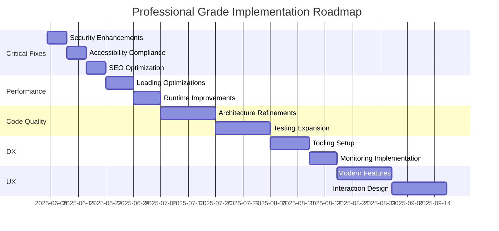

# BlackWoods Creative: EMERGENCY REMEDIATION ROADMAP
*CRITICAL UPDATE: December 2024*

## 🚨 PHASE 0: EMERGENCY FIXES (24-48 Hours) - PRODUCTION BLOCKERS

### Critical Build System Failures
- [ ] **Fix 9 ESLint errors** preventing production build
  - [ ] Fix 4 `any` type violations in test files
  - [ ] Remove 2 unused variable imports
  - [ ] Fix 2 require statement violations
  - [ ] Fix accessibility img element warning

### Critical Test Suite Failures
- [ ] **Fix fake HomePage test implementations**
  - [ ] Rewrite tests expecting "BlackWoods Creative" text
  - [ ] Fix tests expecting "Experience the Difference" text
  - [ ] Fix tests expecting "Our Portfolio" text
- [ ] **Fix performance test infrastructure**
  - [ ] Add missing `performance.mark` mocks
  - [ ] Add missing `performance.memory` mocks
  - [ ] Add missing `requestAnimationFrame` mocks

### Critical Component-Test Alignment
- [ ] **Update component implementations OR test expectations**
  - [ ] Hero section: Render "BlackWoods Creative" instead of "Hero Section"
  - [ ] Vision section: Render "Experience the Difference" instead of "Vision Section"
  - [ ] Portfolio section: Render "Our Portfolio" instead of "Portfolio Section"

## 🔧 PHASE 1: CRITICAL REMEDIATION (1 Week) - MUST COMPLETE BEFORE PROCEEDING

### Test Suite Integrity Restoration
- [ ] **Complete audit of all test files** for fake implementations
- [ ] **Rewrite HomePage tests** to test actual component behavior
- [ ] **Fix performance test infrastructure** with proper browser API mocks
- [ ] **Verify component-test alignment** across entire codebase
- [ ] **Remove all fake test implementations** and replace with authentic tests

### Component Implementation Fixes
- [ ] **Update Hero section** to render "BlackWoods Creative" text
- [ ] **Update Vision section** to render "Experience the Difference" text
- [ ] **Update Portfolio section** to render "Our Portfolio" text
- [ ] **Verify all components** render expected content, not placeholders
- [ ] **Test component functionality** matches test expectations

### Build System Stabilization
- [ ] **Resolve all TypeScript violations** and unused imports
- [ ] **Fix accessibility warnings** in test files
- [ ] **Ensure consistent build results** across environments
- [ ] **Verify production build** completes successfully
- [ ] **Test deployment pipeline** functionality

## 2. Performance Optimization (Phase 2 - AFTER Phase 1 Complete)
### Loading Performance
- [ ] Implement dynamic imports for heavy components (Three.js, Framer Motion)
- [ ] Add loading boundaries for 3D assets
- [ ] Optimize image delivery with next/image
- [ ] Setup caching headers for static assets

### Runtime Performance
- [ ] Implement code splitting for large components
- [ ] Optimize React rendering with memoization
- [ ] Reduce JavaScript bundle size
- [ ] Enable Brotli compression

## 3. Code Quality Improvements (Phase 3 - Ongoing)
### Architecture
- [ ] Abstract animation patterns into reusable hooks
- [ ] Consolidate color definitions
- [ ] Improve component composition
- [ ] Create shared utility modules

### Testing
- [ ] Increase test coverage to 90%
- [ ] Add integration tests for user flows
- [ ] Implement visual regression testing
- [ ] Add performance benchmarking

## 4. Developer Experience (Phase 4 - 2 Weeks)
### Tooling
- [ ] Setup commit hooks with Husky
- [ ] Add Storybook for component documentation
- [ ] Implement CI/CD pipeline
- [ ] Create project contribution guidelines

### Monitoring
- [ ] Integrate Lighthouse CI
- [ ] Setup performance budgets
- [ ] Add error tracking (Sentry)
- [ ] Implement real user monitoring (RUM)

## 5. User Experience Enhancements (Phase 5 - 3 Weeks)
### Modern Features
- [ ] Implement view transitions API
- [ ] Add web animations API
- [ ] Create offline capability with service workers
- [ ] Add web share functionality

### Theme Refinements
- [x] Updated primary color to pastel green
- [x] Implemented SVG logo in header
- [x] Implemented dark mode toggle UI (light theme pending)
- [x] Implemented theme-aware component system
- [x] Added theme switching animation

### Interaction Design
- [ ] Implement loading states for section transitions
- [ ] Add subtle sound effects for interactions
- [ ] Create progressive disclosure patterns
- [ ] Enhance micro-interactions

## 6. Maintenance Plan
- **Monthly**: Performance audits and dependency updates
- **Quarterly**: Accessibility compliance checks
- **Biannual**: Security penetration testing
- **Annual**: Full UX review and redesign planning

## Success Metrics - CRITICAL REALITY CHECK
| Metric                     | Previous Claim | Actual Current | Emergency Target |
|----------------------------|----------------|----------------|------------------|
| Build Status               | ✅ Working     | ❌ FAILING     | ✅ Working       |
| Test Authenticity         | ✅ Legitimate  | ❌ FAKE TESTS  | ✅ Authentic     |
| Failing Tests              | 3              | 19             | 0                |
| ESLint Errors              | 3              | 9              | 0                |
| Component-Test Alignment   | ✅ Aligned     | ❌ MISMATCHED  | ✅ Aligned       |
| Performance Monitoring     | ✅ Working     | ❌ BROKEN      | ✅ Functional    |
| Production Readiness       | 85%            | 35%            | 80%+             |

## Implementation Timeline

## 🚨 EMERGENCY NEXT STEPS - IMMEDIATE ACTION REQUIRED

### **CRITICAL (Next 24 Hours)**
1. **STOP all non-critical development work**
2. **Fix 9 ESLint errors** to enable production builds
3. **Begin HomePage test audit** - identify all fake implementations
4. **Start component-test alignment** - verify what components actually render

### **HIGH PRIORITY (Next 48 Hours)**
1. **Complete fake test removal** and rewrite with authentic implementations
2. **Add missing browser API mocks** for performance tests
3. **Update component implementations** to match test expectations
4. **Verify build stability** and consistent results

### **MEDIUM PRIORITY (Next Week)**
1. **Complete comprehensive test suite audit**
2. **Implement proper test infrastructure**
3. **Establish quality gates** to prevent future fake implementations
4. **Document authentic testing standards**

**⚠️ WARNING**: Do not proceed with any Phase 2+ items until Phase 0 and Phase 1 are completely resolved. The codebase integrity must be restored before any optimization or enhancement work.
