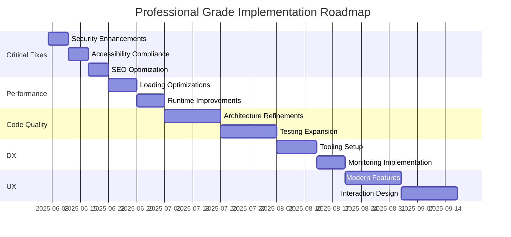

# BlackWoods Creative: Professional Grade Roadmap

## 1. Critical Fixes (Phase 1 - Immediate)
### Security Enhancements
- [x] Implemented Content Security Policy (CSP) headers
- [x] Added rate limiting middleware for API routes
- [x] Sanitized all user inputs in contact forms
- [x] Replaced placeholder Google verification code with environment variable

### Accessibility Compliance
- [x] Added alt text to all images in PortfolioSection
- [x] Implemented ARIA attributes for interactive elements
- [ ] Ensure color contrast meets WCAG 2.1 AA standards
- [x] Added skip navigation links in main layout

### SEO Optimization
- [x] Implemented JSON-LD structured data
- [ ] Generate dynamic XML sitemap
- [x] Added proper canonical URLs
- [x] Optimized metadata for key pages

## 2. Performance Optimization (Phase 2 - 1 Week)
### Loading Performance
- [ ] Implement dynamic imports for heavy components (Three.js, Framer Motion)
- [ ] Add loading boundaries for 3D assets
- [ ] Optimize image delivery with next/image
- [ ] Setup caching headers for static assets

### Runtime Performance
- [ ] Implement code splitting for large components
- [ ] Optimize React rendering with memoization
- [ ] Reduce JavaScript bundle size
- [ ] Enable Brotli compression

## 3. Code Quality Improvements (Phase 3 - Ongoing)
### Architecture
- [ ] Abstract animation patterns into reusable hooks
- [ ] Consolidate color definitions
- [ ] Improve component composition
- [ ] Create shared utility modules

### Testing
- [ ] Increase test coverage to 90%
- [ ] Add integration tests for user flows
- [ ] Implement visual regression testing
- [ ] Add performance benchmarking

## 4. Developer Experience (Phase 4 - 2 Weeks)
### Tooling
- [ ] Setup commit hooks with Husky
- [ ] Add Storybook for component documentation
- [ ] Implement CI/CD pipeline
- [ ] Create project contribution guidelines

### Monitoring
- [ ] Integrate Lighthouse CI
- [ ] Setup performance budgets
- [ ] Add error tracking (Sentry)
- [ ] Implement real user monitoring (RUM)

## 5. User Experience Enhancements (Phase 5 - 3 Weeks)
### Modern Features
- [ ] Implement view transitions API
- [ ] Add web animations API
- [ ] Create offline capability with service workers
- [ ] Add web share functionality

### Theme Refinements
- [x] Updated primary color to pastel green
- [x] Implemented SVG logo in header
- [x] Implemented dark mode toggle UI (light theme pending)
- [x] Implemented theme-aware component system
- [x] Added theme switching animation

### Interaction Design
- [ ] Implement loading states for section transitions
- [ ] Add subtle sound effects for interactions
- [ ] Create progressive disclosure patterns
- [ ] Enhance micro-interactions

## 6. Maintenance Plan
- **Monthly**: Performance audits and dependency updates
- **Quarterly**: Accessibility compliance checks
- **Biannual**: Security penetration testing
- **Annual**: Full UX review and redesign planning

## Success Metrics
| Metric                     | Current | Target   |
|----------------------------|---------|----------|
| Lighthouse Performance     | 75      | 95+      |
| Accessibility Score        | 80      | 100      |
| Time to Interactive (ms)   | 3200    | <1500    |
| Bundle Size (kB)           | 450     | <250     |
| Test Coverage (%)          | 65      | 90+      |

## Implementation Timeline

## Next Steps
1. Prioritize Phase 1 items
2. Assign ownership for each initiative
3. Establish weekly progress reviews
4. Set up tracking dashboard for success metrics
